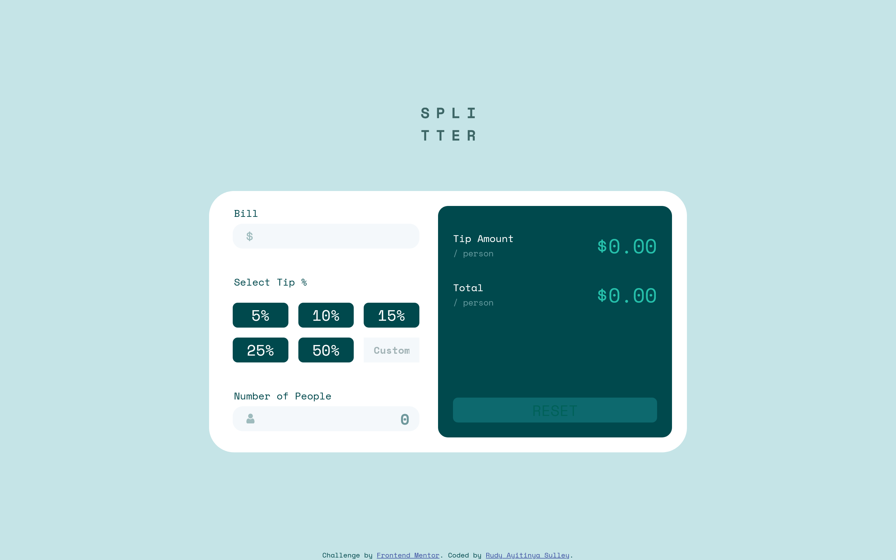
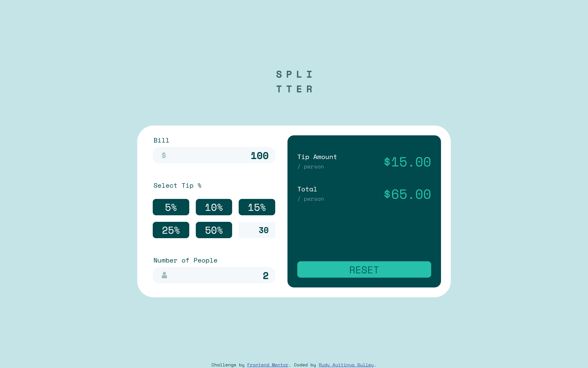
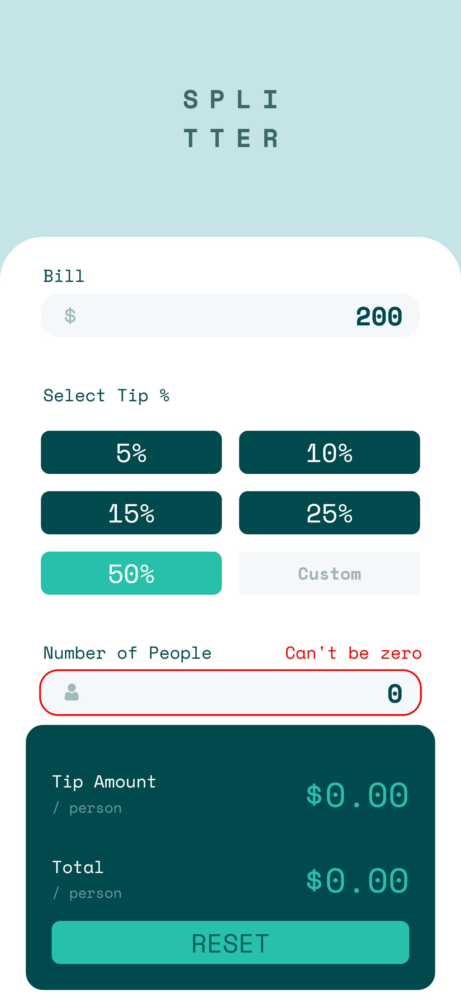

# Frontend Mentor - Tip calculator app solution

This is a solution to the [Tip calculator app challenge on Frontend Mentor](https://www.frontendmentor.io/challenges/tip-calculator-app-ugJNGbJUX). Frontend Mentor challenges help you improve your coding skills by building realistic projects.

## Table of contents

- [Overview](#overview)
  - [The challenge](#the-challenge)
  - [Screenshot](#screenshots)
  - [Links](#links)
- [My process](#my-process)
  - [Built with](#built-with)
  - [What I learned](#what-i-learned)
- [Author](#author)

## Overview

### The challenge

Users should be able to:

- View the optimal layout for the app depending on their device's screen size
- See hover states for all interactive elements on the page
- Calculate the correct tip and total cost of the bill per person

### Screenshots





### Links

- Solution URL: [Add solution URL here](https://github.com/ayitinya/frontend-mentor-tip-calculator-app.git)

## My process

### Built with

- Semantic HTML5 markup
- CSS custom properties
- Flexbox
- CSS Grid
- Mobile-first workflow
- Vanilla JS

### What I learned

1. I learned to remove the number scrollbar in a number input field

```html
<input type="number" />
```

```css
input::-webkit-outer-spin-button,
input::-webkit-inner-spin-button {
	-webkit-appearance: none;
	margin: 0;
}

input[type="number"] {
	-moz-appearance: textfield;
}
```

````

2. Using the ::placeholder pseudo-element to style input placeholders

```css
.input::placeholder {
	text-align: end;
}
````

3. Practiced flexbox more

4. Learned about the css box-model

```css
element {
	box-sizing: border-box|content-box;
}
```

## Author

- Frontend Mentor - [@ayitinya](https://www.frontendmentor.io/profile/ayitinya)
- Twitter - [@ayitinya](https://www.twitter.com/ayintinya)
